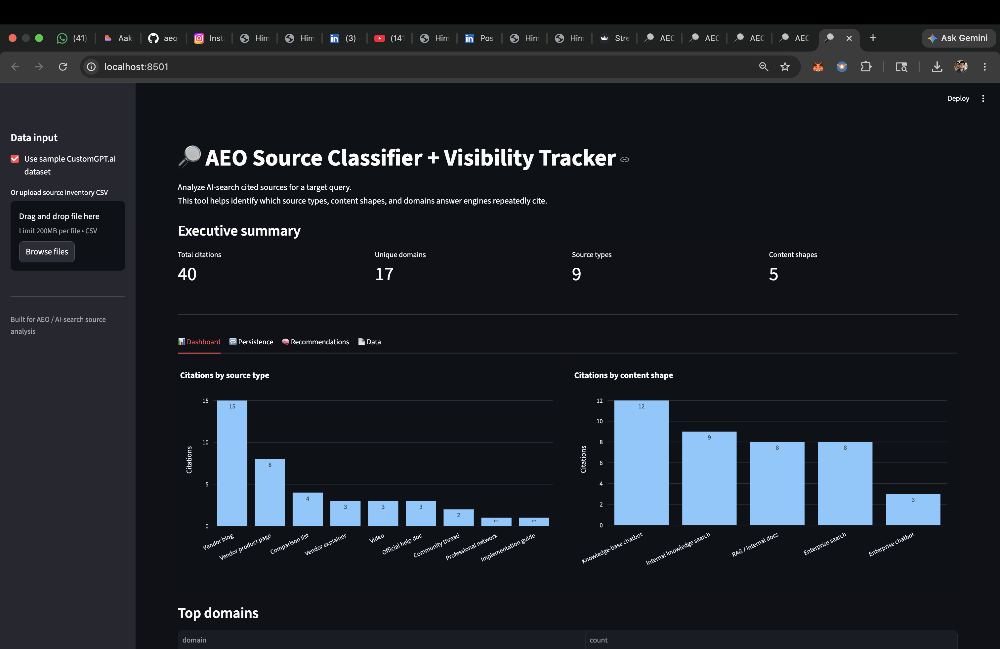
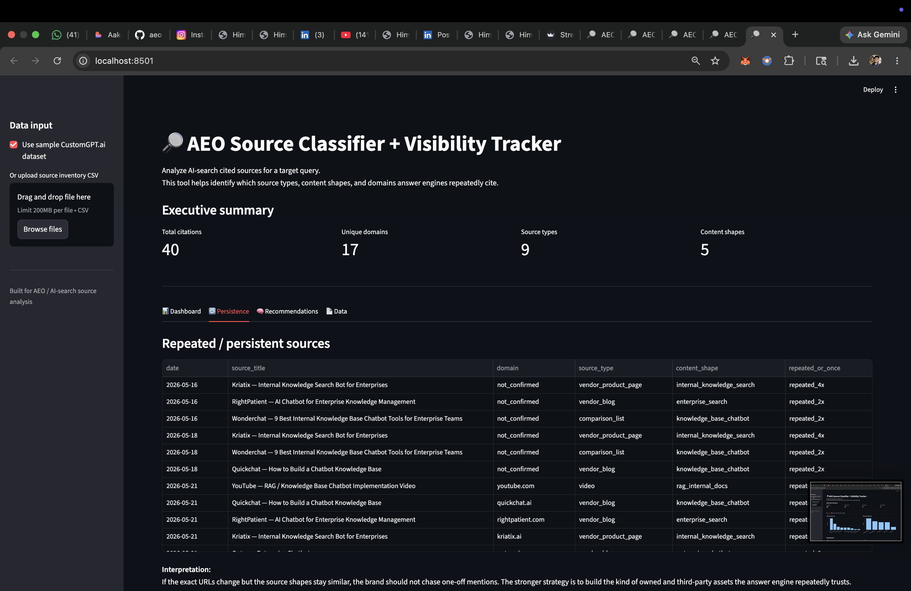
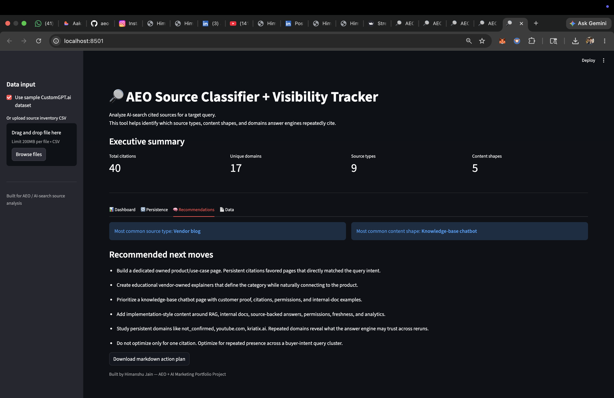

# AEO Source Classifier + Visibility Tracker

A Streamlit app for analyzing which sources AI search engines cite for a target buyer-intent query — and turning that signal into a content action plan.

---

## Why I built this

Answer Engine Optimization (AEO) is still largely a manual, clipboard-and-spreadsheet discipline. I ran a multi-day source-tracking experiment against a real buyer-intent query using a CustomGPT.ai environment, manually logging the sources cited across repeated runs. The patterns were clear but buried in a raw CSV. I built this tool to surface them visually, flag what persisted, and generate a prioritized recommendation — so the analysis workflow could be repeatable rather than one-off.

This is a portfolio project grounded in a real experiment, not a hypothetical demo.

---

## What the tool does

The app takes a source inventory CSV — each row is one cited source from one AI-search run — and answers five operational questions:

- **What source types** are answer engines citing? (vendor blog, product page, comparison list, video, etc.)
- **Which content shapes** repeat across runs? (knowledge-base chatbot, RAG/internal docs, enterprise search, etc.)
- **Which domains** appear most frequently in the citation pool?
- **Is the source pool volatile or stable?** Do the same URLs return, or just the same shapes?
- **What content should the brand build next?** Based on the citation patterns, what owned and third-party assets match what the answer engine already trusts?

The app does not automate AEO. It is a structured source-analysis workflow that makes a manual tracking process faster and more legible.

---

## Dataset used

The included sample dataset (`sample_data/customgpt_source_inventory.csv`) was collected from a personal AEO experiment tracking the query:

> **"AI chatbot for internal knowledge search"**

Sources were logged across 4 snapshots (Day 1, Day 3, Day 6, Day 7), capturing source title, inferred domain, source type, content shape, buyer intent angle, and whether the source appeared once or repeatedly. URLs were confirmed where available; some were inferred from title when not directly captured.

The dataset is not affiliated with or endorsed by CustomGPT.ai. It was produced as independent research for this project.

---

## Features

- **Sample dataset included** — load the experiment data with one checkbox, no upload required
- **CSV upload** — bring your own source inventory tracked against any query
- **Executive summary metrics** — total citations, unique domains, source type count, content shape count
- **Source type distribution chart** — bar chart of citation frequency by source type
- **Content shape distribution chart** — bar chart showing which content formats the answer engine favors
- **Top domains table** — ranked list of the most-cited domains
- **Repeated / persistent sources table** — filtered view of sources that appeared across multiple runs, with interpretation guidance
- **AEO recommendations** — data-driven next moves generated from the citation patterns in the loaded dataset
- **Downloadable cleaned CSV** — export the normalized dataset
- **Downloadable markdown action plan** — export the recommendation output as a `.md` file

---

## Screenshots

| App view | Screenshot |
|---|---|
| Dashboard |  |
| Persistence |  |
| Recommendations |  |

---

## How to run locally

**Requirements:** Python 3.9+

```bash
# 1. Clone the repo
git clone https://github.com/himanshujain/aeo-source-classifier.git
cd aeo-source-classifier

# 2. Install dependencies
pip install -r requirements.txt

# 3. Run the app
streamlit run app.py
```

The app will open at `http://localhost:8501`. The sample dataset loads automatically — no upload needed to explore the tool.

**To use your own data**, upload a CSV with these columns:

| Column | Description |
|---|---|
| `date` | Date of the snapshot |
| `query` | The target query that was run |
| `source_title` | Title of the cited source |
| `source_url` | URL (use `not_captured` if unavailable) |
| `domain` | Root domain of the source |
| `source_type` | Type of source (e.g. `vendor_blog`, `comparison_list`) |
| `content_shape` | Content format (e.g. `knowledge_base_chatbot`, `rag_internal_docs`) |
| `buyer_intent_angle` | Intent classification (e.g. `tool_evaluation`, `category_education`) |
| `repeated_or_once` | Whether the source reappeared (`repeated_Nx` or `once`) |
| `notes` | Free-text observations |

---

## Example use case

A B2B SaaS company wants to understand why a competitor's product page keeps appearing in AI-search results for their core category query. They run the query 4–5 times across a week, log the cited sources into the CSV template, upload it here, and within minutes can see:

- Which source types are dominating (vendor product pages, not blogs)
- Which content shapes the answer engine gravitates toward (knowledge-base chatbot format)
- Which domains are persistent vs. one-off
- What owned content to build next to enter the citation pool

---

## Key learning

The most actionable finding from the experiment: **URL volatility does not mean source-pattern volatility**. The exact URLs changed across snapshots, but the source types and content shapes that appeared were consistent. This means optimizing for a single citation is the wrong frame. The stronger strategy is building the kind of content the answer engine repeatedly trusts — regardless of which specific URL it picks on a given day.

---

## Future improvements

- Multi-query comparison view (track citation patterns across a cluster of related queries)
- Domain trust scoring based on repeat frequency
- Competitor overlap analysis (which domains appear for you vs. your competitors)
- CSV template download to standardize manual tracking
- Support for tagging sources by brand ownership (owned vs. earned vs. third-party)

---

## Tech stack

| Layer | Tool |
|---|---|
| App framework | [Streamlit](https://streamlit.io) |
| Data processing | [pandas](https://pandas.pydata.org) |
| Charts | [Plotly Express](https://plotly.com/python/plotly-express/) |
| Language | Python 3.9+ |

---

Built by [Himanshu Jain](https://github.com/himanshujain) — AEO + AI Marketing Portfolio Project
